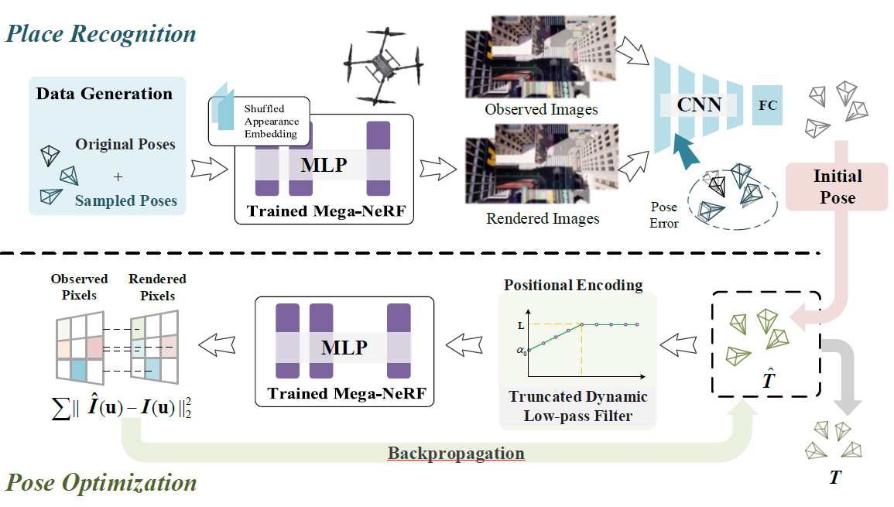
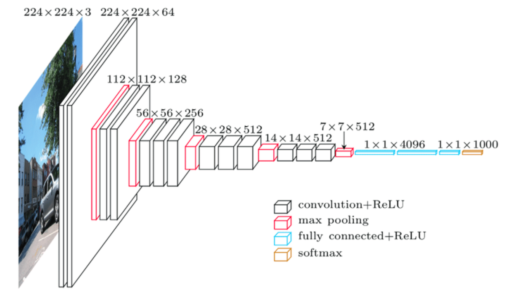
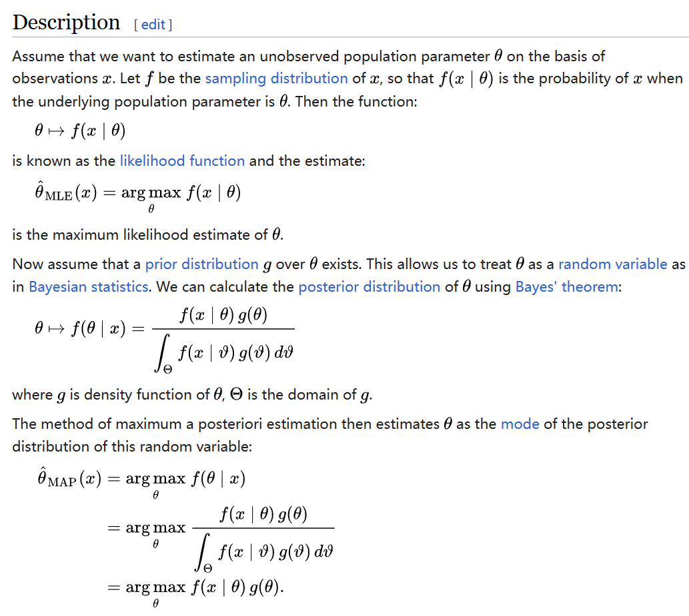

This paper proposes a two-stage localization mechanism in city-scale NeRF.

<!-- more -->

## Abstract

Neural Radiance Fields (NeRFs) have made great success in representing complex 3D scenes with high-resolution details and efficient memory. Nevertheless, current NeRF-based pose estimators have no initial pose prediction and are prone to local optima during optimization. In this paper, we present LATITUDE: Global Localization with Truncated Dynamic Low-pass Filter, which introduces a two-stage localization mechanism in city-scale NeRF. 

- In place recognition stage, we train a regressor through images generated from trained NeRFs, which provides an initial value for global localization.
- In pose optimization stage, we minimize the residual between the observed image and rendered image by directly optimizing
  the pose on the tangent plane. 

- To avoid falling into local optimum, we introduce a Truncated Dynamic Low-pass Filter (TDLF) for coarse-to-fine pose registration. 

We evaluate our method on both synthetic and real-world data and show its potential applications for high-precision navigation in large scale city scenes.

## System Design

- Place Recognition
  1. Original poses, accompanied by additional poses around the original ones are sampled.
  2. The pose vector is passed through the trained and fixed Mega-NeRF with shuffled appearance embeddings. 
  3. Initial poses of the inputted images are predicted by a pose regressor network. 
- Pose Optimization
  1. The initial poses are passed through positional encoding filter
  2. The pose vector is passed through the trained and fixed Mega-NeRF and generates a rendered image.
  3. Calculate the photometric error of the rendered image and the observed image and back propagate to get a more accurate pose with the TDLF.

### Implementation

#### Place Recognition

- **Data Augmentation:** A technique in machine learning used to reduce overfitting when training a machine learning model by training models on several slightly-modified copies of existing data.

  First uniformly sample several positions in a horizontal $H\times W$ rectangle area around each position around original poses $T_{real}(\mathbf x_{real},\mathbf q_{real})$. Then add random perturbations on each axis drawn evenly in $[-\theta,\theta]$, where $\theta$ is the max amplitude of perturbation to form sampled poses $T_{syn}(\mathbf x_{syn},\mathbf q_{syn})$. They are used to generate the rendered observations $I_{syn}$ by inputting the poses to Mega-NeRF. 

  To avoid memory explosion, we generate the poses using the method above and use Mega-NeRF to render images during specific epochs of pose regression training.

  Additionally, Mega-NeRF’s appearance embeddings are selected by randomly interpolating those of the training set, which can be considered as a data augmentation technique to improve the robustness of the APR model under different lighting conditions.

  

  

- **Pose Regressor**: Absolute pose regressor (APR) networks are trained to estimate the pose of the camera given a captured image.

  - Architecture: Built on top of VGG16’s light network structure, we use 4 full connection layers to learn pose information from image sequences.

    - Input: Observed image $I_{real}$ (resolution $480 \times 240$),  rendered observations $I_{syn}$ 

    - Output:  Corresponding estimated poses $\hat T_{real}(\mathbf {\hat x}_{real},\mathbf {\hat q}_{real})$, $\hat T_{syn}(\mathbf {\hat x}_{syn},\mathbf {\hat q}_{syn})$. 

    - Loss Function: (In general, the model should trust more on real-world data and learn more from it.)
      $$
      \begin{aligned}
      	L_{syn}&=\Vert\mathbf {\hat x}_{syn}-\mathbf {x}_{syn}\Vert_2+\gamma\left\Vert\mathbf {\hat q}_{syn}-\frac{\mathbf {q}_{syn}}{||\mathbf {\hat q}_{syn}||}\right\Vert_2\\\\
      	L_{real}&=\Vert\mathbf {\hat x}_{real}-\mathbf {x}_{real}\Vert_2+\gamma\left\Vert\mathbf {\hat q}_{real}-\frac{\mathbf {q}_{real}}{||\mathbf {\hat q}_{real}||}\right\Vert_2\\\\
      	L&=L_{real}+\beta L_{syn}
      \end {aligned}
      $$

#### Pose Optimization

- **MAP Estimation Problem<a id="biba" href="#bibaref">[A]</a> Formulation:** 
  $$
  P(\hat T_k |F(\epsilon), I_k)\propto P(\hat I_k|\hat T_k, F(\epsilon))P(\hat T_k|I_k)
  $$
  Here $P(\hat T_k|I_k)$ denotes place recognition; $F(\epsilon)$ denotes the trained Mega-NeRF. 

  We optimize posterior $P(\hat T_k |F(\epsilon), I_k) $by minimizing the photometric error of $I_k$ and the image $\hat I_k$ rendered by $F(\epsilon)$.

- **Optimization on Tangent Plane:** We optimize pose on tangent plane to ensure a smoother convergence. <a id="bib1" href="#bib1ref">[1]</a>

  `TODO` I know nothing about $SE(3)$ :(

## Explanations & References

<a href="#bib1" id="bib1ref">[1]</a>Adamkiewicz, M., Chen, T., Caccavale, A., Gardner, R., Culbertson, P., Bohg, J., & Schwager, M. (2022). Vision-only robot navigation in a neural radiance world. *IEEE Robotics and Automation Letters*, *7*(2), 4606-4613. https://arxiv.org/pdf/2110.00168.pdf

Turki, H., Ramanan, D., & Satyanarayanan, M. (2022). Mega-nerf: Scalable construction of large-scale nerfs for virtual fly-throughs. 	In *Proceedings of the IEEE/CVF Conference on Computer Vision and Pattern Recognition* (pp. 12922-12931). https://arxiv.org/pdf/2112.10703.pdf

Yen-Chen, L., Florence, P., Barron, J. T., Rodriguez, A., Isola, P., & Lin, T. Y. (2021, September). inerf: Inverting neural radiance fields 	for pose estimation. In *2021 IEEE/RSJ International Conference on Intelligent Robots and Systems (IROS)* (pp. 1323-1330). IEEE. https://arxiv.org/pdf/2012.05877.pdf

<a href="#biba" id="bibaref">[A]</a>Maximum A Posterior (MAP) Estimation: Maximum a posteriori (MAP) estimation is a method of statistical inference that uses Bayes' theorem to find the most likely estimate of a parameter given some observed data.

- 

- [Maximum a posteriori estimation - Wikipedia](https://en.wikipedia.org/wiki/Maximum_a_posteriori_estimation)

