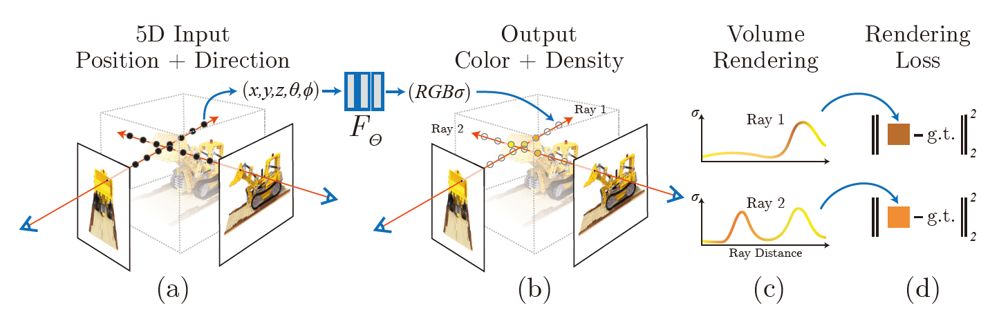
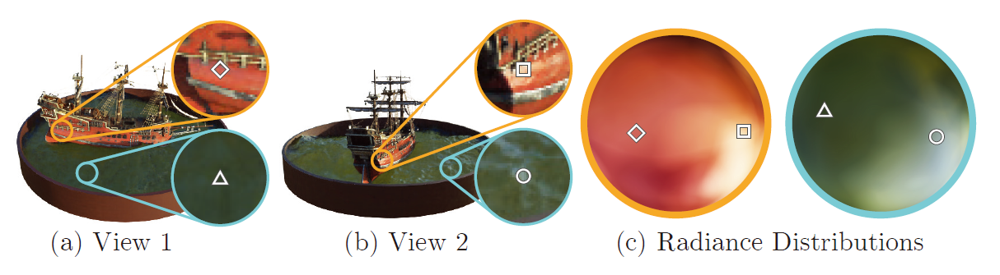
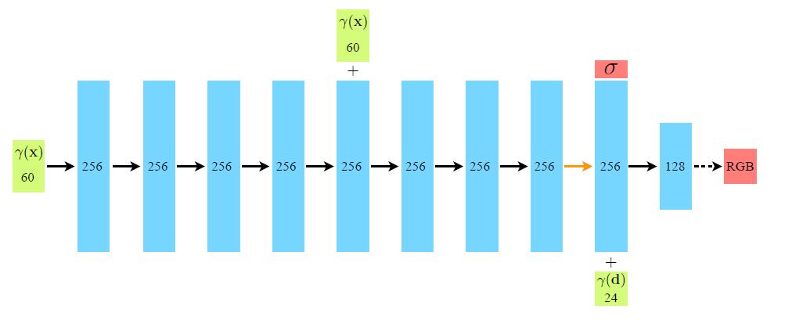
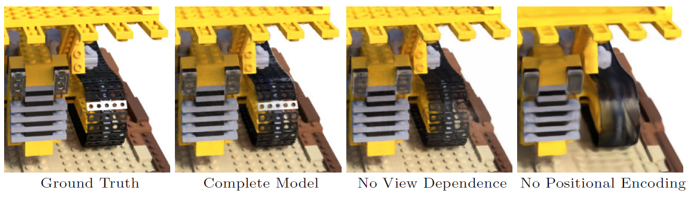

This is a summary for paper "NeRF: Representing Scenes as Neural Radiance Fields for View Synthesis".

**Keywords:** scene representation, view synthesis, image-based rendering, volume rendering, 3D deep learning

<!-- more -->

## A brief understanding: How to train a network for NeRF

Training a neural network for NeRF (Neural Radiance Fields) involves several steps, including data preparation, network architecture design, training, and evaluation.                 

1. **Data preparation:** The first step is to prepare the data that will be used to train the neural network. This typically involves capturing a set of 3D scans of the object or environment being represented, and labeling the data with the corresponding colors that should be associated with each point in the 3D space.       
2. **Network architecture design:** The next step is to design the architecture of the neural network that will be used to represent the object or environment. This typically involves defining the number and types of layers in the network, as well as the size and shape of the network. 
3. **Training:** Once the network architecture has been designed, the next step is to train the network using the prepared data. This involves feeding the data into the network and adjusting the weights of the network over multiple iterations, or epochs, to optimize the performance of the network. 
4. **Evaluation:** After the network has been trained, it is typically evaluated on a separate set of data to measure its performance and ensure that it is generating accurate results. This can involve comparing the output of the network to the ground truth data, as well as using visualization techniques to compare the rendered images produced by the network to actual photographs of the object or environment.                                                                                                                                    

Overall, the process of training a neural network for NeRF involves a combination of data preparation, network architecture design, training, and evaluation to produce a highly accurate and efficient 3D representation of an object or environment.  

​	By *Vicuna-13b*

## Contribution

> - An approach for representing continuous scenes with complex geometry and materials as 5D neural radiance fields, parameterized as basic MLP networks. 
> - A differentiable rendering procedure based on classical volume rendering techniques, which we use to optimize these representations from standard RGB images. This includes a hierarchical sampling strategy to allocate the MLP's capacity towards space with visible scene content.
> - A positional encoding to map each input 5D coordinate into a higher dimensional space, which enables us to successfully optimize neural radiance fields to represent high-frequency scene content.

An overview of our neural radiance field scene representation and differentiable rendering procedure. Here g.t. represents the "ground truth", which means the real scene.

### Overview of the Rendering Process

1. March camera rays through the scene to generate a sampled set of 3D points.
2. Use those points and their corresponding 2D viewing directions as input to the **neural network** to produce an output set of colors and densities.
3. use classical volume rendering techniques to accumulate those colors and densities into a 2D image.

we can use gradient descent to optimize this **model** by minimizing the error between each observed image and the corresponding views rendered from our representation.

### Neural Radiance Field Scene Representation

This is a method for synthesizing novel views of complex scenes by optimizing an underlying continuous volumetric scene function using a sparse set of input views. Our algorithm represents a scene using a fully-connected (non-convolutional) deep network $F_\Theta$, whose input is a single continuous 5D coordinate and whose output is the volume density and view-dependent emitted radiance at that spatial location. 
$$
F_\Theta: (\textbf x,\textbf d)\rightarrow (\textbf c,\sigma)
$$
$\mathbf{x}$: 3D location $(x,y,z)$

$\mathbf d$: 2D viewing direction $(\theta,\phi)$

$\mathbf c$: Emitted color $(r,g,b)$

$\sigma$: Volume density

### From Object to Scene: Volume Rendering with Radiance Fields

Our 5D neural radiance field represents a scene as the volume density and directional emitted radiance at any point in space.

We render the color of any ray passing through the scene using principles from classical volume rendering<a id="bib1" href="#bib1ref">[1]</a>.

The volume density $\sigma(\mathbf x)$ can be interpreted as the differential probability<a id="bib2" href="#bib2ref">[2]</a> of a ray terminating at a particle at location $\mathbf x$.

The expected color $C(\mathbf r)$ of camera ray $\mathbf r (t)$ with near bound $t_n$ and far bound $t_f$.
$$
C(\mathbf r) = \int_{t_n}^{t_f}T(t)\sigma(\mathbf{r}(t))\mathbf{c}(\mathbf{r}(t),\mathbf{d})dt
$$
$\mathbf r(t)=\mathbf o+t\mathbf d$: Camera ray, where $\mathbf o$ is the position of the camera, $t$ is the position of the point in the 3D space being rendered, and $\mathbf d$ is the direction of the camera ray.

$T(t) = \exp{(-\int_{t_n}^{t}\sigma(\mathbf{r}(s))ds)}$: Denotes the accumulated transmittance along the ray from $t_n$ to $t$, i.e., the probability that the ray travels from tn to t without hitting any other particle. 

**Example:**

In (a) and (b), we show the appearance of two fixed 3D points from two different camera positions: one on the side of the ship (orange insets) and one on the surface of the water (blue insets). Our method predicts the changing appearance of these two 3D points with respect to the direction of observation $\mathbf d$, and in (c) we show how this behavior generalizes continuously across the whole hemisphere of viewing directions(This hemisphere can be viewed as the plot of $(\mathbf c,\mathbf d)$, where $\mathbf d$ is the unit vector in the spherical coordinate frame and $c$ shows the color).

#### Discrete Sampling

Rendering a view from our **continuous neural radiance field** requires estimating this integral $C(r)$ for a camera ray traced through each pixel of the desired virtual camera. However, MLP would only be queried at a discrete set of locations. So we use deterministic quadrature<a id="bib3" href="#bib3ref">[3]</a> to numerically estimate this continuous integral. 

we partition $[t_n,t_f]$ into $N$ evenly-spaced bins and then draw one sample uniformly at random from within each bin:
$$
t_i \sim \mathcal{U} \left[ t_n + \frac{i-1}{N}(t_f-t_n),\,\, t_n + \frac{i}{N}(t_f-t_n) \right]\
$$

### From Scene to Object: Estimation of $C(\mathbf r)$

$$
(c_i,r_i)\rightarrow \hat C(\mathbf r)=\sum_{i=1}^{N}T_i (1-\exp({-\sigma_i \delta_i})) \mathbf{c}_i
$$

$$
T_i=\exp(- \sum_{j=1}^{i-1} \sigma_j \delta_j)
$$

$\delta_i=t_{i+1}-t_i$ : The distance between adjacent samples 

This function for calculating $\hat{C}(\mathbf{r})$ from the set of $(\mathbf{c}_i, \sigma_i)$ values is trivially differentiable and reduces to traditional alpha compositing<a id="bib4" href="#bib4ref">[4]</a> with alpha values $\alpha_i = 1-\exp(-\sigma_i \delta_i)$. 

## Implementation details

### Network Architecture

- First $8$ layers (ReLU): 
  - Input: 3D coordinate $\mathbf{x}$ processed by $\gamma$
  - Output:   $\sigma$ ; 256-dimensional feature vector.
- $9^{th}$ layer: 
  - Input:  $\sigma$ ; 256-dimensional feature vector; Cartesian viewing direction unit vector $\mathbf{d}$ processed by $\gamma$
  - Output: **View-dependent** RGB color

Details of variables are in [Improving Scenes of High Frequency](#Improving%20Scenes%20of%20High%20Frequency). 

### Training

- **Datasets:** Captured RGB images of the scene, The corresponding camera poses and intrinsic parameters, and Scene bounds (we use ground truth camera poses, intrinsics, and bounds for synthetic data, and use the [COLMAP structure-from-motion package](https://github.com/colmap/colmap) to estimate these parameters for real data)

- **Iteration:** Randomly sample a batch of camera rays from the set of all pixels in the dataset following the [hierarchical sampling](#Reducing%20the%20Cost%20with%20Hierarchical%20Sampling)

- **Loss:** The total squared error between the rendered and true pixel colors for both the coarse and fine renderings
  $$
  L=\sum_{\mathbf r\in Rays}\left[||{\hat C_c(\mathbf r)-C(\mathbf r)||_2^2+||\hat C_f(\mathbf r)-C(\mathbf r)}||_2^2\right]
  $$

> In our experiments, we use a batch size of 4096 rays, each sampled at $N_c=64$ coordinates in the coarse volume and $N_f=128$ additional coordinates in the fine volume. We use the Adam optimizer with a learning rate that begins at $5 \times 10^{-4}$ and decays exponentially to $5 \times 10^{-5}$ over the course of optimization (other Adam hyper-parameters are left at default values of $\beta_1=0.9$, $\beta_2=0.999$, and $\epsilon=10^{-7}$). The optimization for a single scene typically take around 100--300k iterations to converge on a single NVIDIA V100 GPU (about 1--2 days).

### Notable Tricks

#### Improving Scenes of High Frequency

Deep networks are biased towards learning lower frequency functions.

findings in the context of neural scene representations, and show that reformulating $F_\Theta$ as a composition of two functions ${F_\Theta = F'_\Theta \circ \gamma }$, where $\gamma$ is fixed. It is used to map variables of $R$ to $R^{2L}$.
$$
\gamma(p) = \left(
    \begin{array}{ccccc}
    \sin\left(2^0 \pi  p\right), &
    \cos\left(2^0 \pi  p\right), &
    \cdots, &
    \sin\left(2^{L-1} \pi  p\right), &
    \cos\left(2^{L-1} \pi  p\right)
    \end{array} \right) 
$$
This function $\gamma(\cdot)$ is applied **separately** to each of the three coordinate values in $\mathbf{x}$ (which are normalized to lie in $[-1, 1]$) and to the three components of the Cartesian viewing direction unit vector $\mathbf{d}$ (which by construction lie in $[-1,1]$). 

In the experiments, we set $L=10$ for $\gamma(\mathbf x)$ and $L=4$ for $\gamma(\mathbf d)$. 

#### Reducing the Cost with Hierarchical Sampling

Our rendering strategy of densely evaluating the neural radiance field network at $N$ query points along each camera ray is inefficient: free space and occluded regions that do not contribute to the rendered image are still sampled repeatedly.

Instead of just using a single network to represent the scene, we simultaneously optimize two networks: one "coarse'' and one "fine''.

##### The coarse Network

Rewrite the alpha composited color as a weighted sum of all sampled colors $c_i$ along the ray:
$$
\hat C_c(\mathbf r)=\sum_{i=1}^{N_c}\omega_i c_i\,, \quad\,\,
  \omega_i = T_i(1-\exp(-\sigma_i \delta_i))
$$
$N_c$: The number of sampling points for coarse network.

##### The fine Network

Normalizing $\omega_i$ as $\hat \omega_i ={\omega_i}/{\sum_{j=1}^{N_c} \omega_j}$ produces a piecewise-constant PDF along the ray. Then sample from $N_f$ locations from this distribution using inverse transform sampling<a id="bib5" href="#bib5ref">[5]</a>. Then we evaluate $\hat C_f(\mathbf r)$ using $N_c+N_f$ samples.

## Conclusion

`TODO`

## Explanations

 <a href="#bib1" id="bib1ref">[1]</a> Volume rendering is a technique used in computer graphics and computer vision to visualize 3D data sets as 2D images. It works by slicing the 3D data set into a series of thin layers, and then rendering each layer as a 2D image from a specific viewpoint. These 2D images are then composited together to form the final volume rendering.

 <a href="#bib2" id="bib2ref">[2]</a> If a distribution (here in 3D space) has a density $f(x,y,z)$, that means that for (almost) any volume in that space $V$, you can assign a probability to it by integrating the density (here "density" means probability per unit volume, very similar to, say, the concentration of salt in a solution).

 <a href="#bib3" id="bib3ref">[3]</a> Deterministic quadrature is a mathematical method used to estimate the definite integral of a function. The basic idea is to divide the area under the curve into smaller areas, and calculate the approximate value of the definite integral by summing the areas of the smaller areas. There are several types of deterministic quadrature methods, including the trapezoidal rule, Simpson's rule, and Gaussian quadrature.

 <a href="#bib4" id="bib4ref">[4]</a> Alpha compositing is a technique used in computer graphics and image processing to combine two or more images or video frames by blending them together using an alpha channel. The alpha channel is a mask that defines the transparency or opacity of each pixel in the image. Alpha compositing is used to create composites, where the resulting image is a combination of the original images, with the transparency or opacity of each image controlled by the alpha channel. The alpha channel can be used to create effects such as blending, fading, and layering. [Alpha compositing - Wikipedia](https://en.wikipedia.org/wiki/Alpha_compositing)

 <a href="#bib5" id="bib5ref">[5]</a> Inverse transform sampling (ITS) is a technique used in digital signal processing to reconstruct a signal from a set of samples. It is the inverse of the discrete Fourier transform(DFT). The basic idea behind ITS is to use the Fourier coefficients obtained from DFT to reconstruct the signal in the time domain.   [Inverse transform sampling - Wikipedia](https://en.wikipedia.org/wiki/Inverse_transform_sampling)

