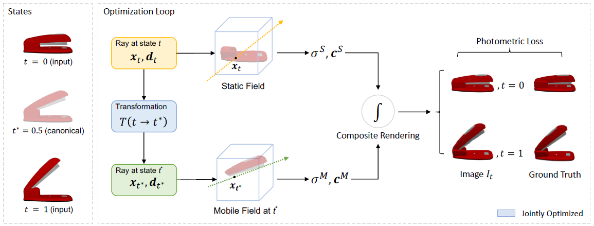

**ABSTRACT:** This paper introduces a self-supervised, end-to-end architecture that learns part-level implicit shape and appearance models and optimizes motion parameters jointly without requiring any 3D supervision, motion, or semantic annotation. The training process is similar to original NeRF but and extend the ray marching and volumetric rendering procedure to compose the two fields.

<!-- more -->

[[Arxiv](https://arxiv.org/abs/2308.07391)] [[Github](https://github.com/3dlg-hcvc/paris)] [[Project Page](https://3dlg-hcvc.github.io/paris/)]

## Problem Statement

The problem of articulate object reconstruction in this paper can be summarized as: Given start state $t=0$ and end state $t=1$ and corresponding multi-view RGB images $I^t$ and camera parameters. 

The first problem is to decouple the object into static and movable part. Here the paper assumes that an object has only one static and one movable part.

The second problem is to estimate the articulated motion $T\in\{f_{p,q}, f_{a,d}\}$ . A revolute joint is parametrize as $f_{p,q}$ a pivot point $p\in\mathbb R^3$ and a rotation as quaternion $q\in\mathbb R^4$, $||q||=1$. A prismatic joint is modeled as $f_{a,d}$ a joint axis as unit vector $a \in\mathbb R^3$ and a translation distance $d$. The training process will adapt one of them as prior info states. If no such prior info is given, the motion is modeled by $\mathbf{SE}(3)$. 

## Method

This paper divides the parts by registration on input state $t$ to a canonical state $t^*$. The components agrees with the transformation is extracted as moving part and the remaining as the static part.

### Structure

 Static and moving part are jointly learnt during training and they are built separately on networks with the same structure that built upon InstantNGP. Their relationship is modeled explicitly as the transformation function $T$ as described in Problem Statement.

The fields are represented as: 
$$
\left\{
\begin{aligned}
\mathtt{Static}:& \mathcal{F}^S(\mathbb x_t,\mathbb d_t)=
\sigma^S(\mathbb x_t),c^S(\mathbb x_t,\mathbb d_t)\\

\mathtt{Mobile}:& \mathcal{F}^S(\mathbb x_{t^*},\mathbb d_{t^*})=
\sigma^S(\mathbb x_{t^*}),c^S(\mathbb x_{t^*},\mathbb d_{t^*})\\

\end{aligned}
\right.
$$
Here $\mathbb x_t\in \mathbb R^3$ is a point sampled along a ray at state $t$ with direction. $\mathbb d_t\in \mathbb R^3$. $\sigma(\mathbb x)\in \mathbb R$ is the density value of the point x, and $c(\mathbb x,\mathbb d)$ is the RGB color predicted from the point x from a view direction $d$ .  

### Training

The adapted training pipeline is similar to NeRF and the ray marching and volumetric rendering procedure to compose the two fields is extended. 

