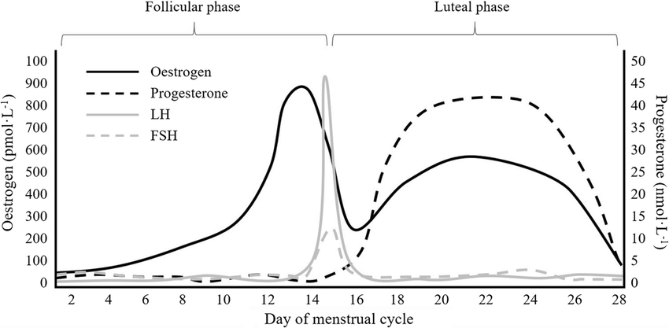
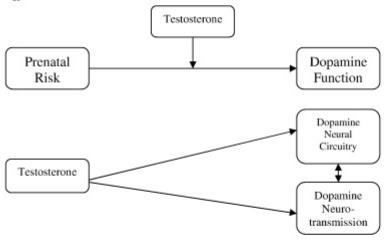

Written after I fucked up my therapy due to gastrointestinal disorder as a remainder. Don't take it seriously.

<!-- more -->

While male with ADHD often have noticeable symptoms like hyperactivity or disruptive behavior, females with ADHD are often characterized by inattention, forgetfulness, and internalized behaviors (e.g., anxiety, depression). This can lead to females being overlooked or misdiagnosed with other conditions like anxiety or depression. Interestingly, symptoms observed from transgender individuals can be consistent with their gender identity even before Hormone Replacement Therapy (HRT). 

## Effects of Female Hormones

The change of estrogen and progesterone is highly related to ADHD symptoms. The symptoms are consistent with menstrual cycle, making it more acute when experiencing premenstrual syndrome (PMS) and premenstrual dysphoric disorder (PMDD).

Effects for hyperactivity-impulsivity appeared mainly driven by declines in estrogen regardless of levels of progesterone, consistent with more of an ovulatory effect. In contrast, inattentive effects were driven by declines in estrogen but were moderated by levels of progesterone.[^1] 

In the follicular phase, which is the period when estrogen levels are steadily increasing, ADHD symptoms are at their lowest. [^2] 

While ADHD risk appears to be highest for males during the prenatal period, females experience heightened risk during multiple reproductive periods.  Adolescents are particularly vulnerable to the impact of hormones and environmental stressors. This may lead to a structural change in brain, causing a rising possibility of triggering ADHD symptoms. Evidences shown that many female individuals are diagnosed after adolescence, while they may have minimal or no symptoms suggesting ADHD. 

> Interestingly, transgender female may be diagnosed as adult ADHD after they started Hormone Replacement Therapy (HRT). 

Changes in response to ADHD medications likely reflect the point in the menstrual cycle that a woman is and where all these different hormones are. In practice, clinicians may adjust medication and even add additional medication to help women manage their ADHD and period-related exacerbations. Hormonal changes at puberty — especially the higher levels of estrogen and progesterone — can cause ADHD medications to be less effective. Studies have shown that estrogen may enhance a woman’s response to amphetamine medications, but this effect may be diminished in the presence of progesterone.[^3]

Additionally, The loss of estrogen leads to a decrease in serotonin and dopamine levels in the brain leads to a higher rate of moodiness, sadness, irritability, fatigue, fuzzy thinking, and memory lapses.[^4] A combination of HRT with ADHD medication often improves symptoms most effectively.

## Effects of Testosterone

ADHD exhibits a prominent sex-biased prevalence rate in childhood with a 3:1 ratio favoring boys. [^5] Testosterone plays a crucial role in attention, focus, and inhibitory control, functions that are often impaired in ADHD. However, studies also suggest that testosterone supplementation may alleviate some symptoms, such as hyperactivity and impulsivity. [Cognitive control](https://carterlab.ucdavis.edu/research/control.php) was impaired in girls with mild and severe ADHD  (Inattentive and Combined subtypes of ADHD), but only in boys with  severe ADHD (Combined ADHD subtype), suggesting that girls needed more  severe impairment in order to exhibit symptoms. [^6]

A steady testosterone level leads to improved focus, better emotional regulation,  and increased body strength.[^8] This is obviously beneficial to ADHD symptoms since the major way to reduce the effect of ADHD is Mindfulness-Based Cognitive Therapy (MBCT) and exercise. High testosterone level may worsen hyperactive and impulsive symptoms, leading ADHD boys being "too energetic" but easier to be discovered and diagnosed. 

Hypothesis suggests that prenatal testosterone exposure may have potential effects on ADHD symptoms. A survey conducted by [^7] indicated that higher fetal  testosterone levels may play a role, not only in the origin of autism,  but also in the aetiology of PDD-NOS and of ADHD/ODD. Males with anxiety disorders might have been exposed to lower prenatal testosterone levels. Evidence from [Turner's Syndrome](https://en.wikipedia.org/wiki/Turner_syndrome) also suggests that higher testosterone:estrogen ratios relate to cognitive control problems similar to those seen in ADHD.

## Symptoms of Transgender Individuals

> No reliable resources available. 

Changes in hormones during puberty is also vital for brain circuitry  development. For example, several types of reproductive and social behaviors (e.g.,  sexual behavior, scent marking, social interactions) are impaired in  male rodents if they are castrated before puberty.[^9]  These changes may result in organizational effects on the brain, and hormone replacement in adulthood does not reverse these deficits. [^8] 

Transgender indivudals are reported to have a higher rate of having ADHD, ASD than their peers, which may resulted from social pressure or changes in hormone levels. 

---

The link between sex hormones to ADHD symptoms is still not clear, it can effect structural development of brain during puberty and controls our daily behaviors. Even hormone exposure levels during pregnancy may be a vital factor.  Most of the effects presented are just having "correlation" instead of "causality" with hormones. 

To sum up, DO NOT mess up any medication for any reason.

## References

[^1]:Eg, A.G., Nirjar, U., Elkins, A.R., Sizemore, Y.J., Monticello, K.N., Petersen, M.K., Miller, S.A., Barone, J., Eisenlohr-Moul, T.A., & Martel, M.M. (2024). Attention-deficit/hyperactivity disorder and the menstrual cycle: Theory and evidence. *Hormones and Behavior, 158*(105466). ISSN 0018-506X. https://doi.org/10.1016/j.yhbeh.2023.105466
[^2]:Broadway, C. (2024, April 19). *High and low estrogen exacerbate ADHD symptoms in females: New theory*. ADDitude. https://www.additudemag.com/low-estrogen-adhd-hormones-theory/
[^3]:Roberts, B., Eisenlohr-Moul, T., & Martel, M. M. (2018). Reproductive steroids and ADHD symptoms across the menstrual cycle. *Psychoneuroendocrinology*, *88*, 105–114. https://doi.org/10.1016/j.psyneuen.2017.11.015
[^4]:Weber, M. T., Maki, P. M., & McDermott, M. P. (2014). Cognition and Mood in Perimenopause: A Systematic Review and Meta-Analysis. *The Journal of steroid biochemistry and molecular biology*, *142*, 90–98. https://doi.org/10.1016/j.jsbmb.2013.06.001
[^5]: *American Psychiatric Association (2000). Diagnostic and Statistical Manual of Mental Disorders Fourth edition Text Revision (DSM-IV-TR). Washington DC American Psychiatric Association. - References - Scientific Research Publishing*. (n.d.). https://www.scirp.org/reference/referencespapers?referenceid=2182002
[^6]: Nigg, J. T., Blaskey, L. G., Huang-Pollock, C. L., & Rappley, M. D. (2002). Neuropsychological executive functions and DSM-IV ADHD subtypes. *Journal of the American Academy of Child & Adolescent Psychiatry*, *41*(1), 59–66. https://doi.org/10.1097/00004583-200201000-00012
[^7]: De Bruin, E. I., Verheij, F., Wiegman, T., & Ferdinand, R. F. (2006). Differences in finger length ratio between males with autism, pervasive developmental disorder–not otherwise specified, ADHD, and anxiety disorders. *Developmental Medicine & Child Neurology*, *48*(12), 962. https://doi.org/10.1017/s0012162206002118
[^8]: Martel, M. M., Klump, K., Nigg, J. T., Breedlove, S. M., & Sisk, C. L. (2009). Potential hormonal mechanisms of Attention-Deficit/Hyperactivity Disorder and Major Depressive Disorder: A new perspective. *Hormones and Behavior*, *55*(4), 465–479. https://doi.org/10.1016/j.yhbeh.2009.02.004
[^9]: Schulz, K. M., & Sisk, C. L. (2006). Pubertal hormones, the adolescent brain, and the maturation of social behaviors: Lessons from the Syrian hamster. *Molecular and Cellular Endocrinology*, *254–255*, 120–126. https://doi.org/10.1016/j.mce.2006.04.025