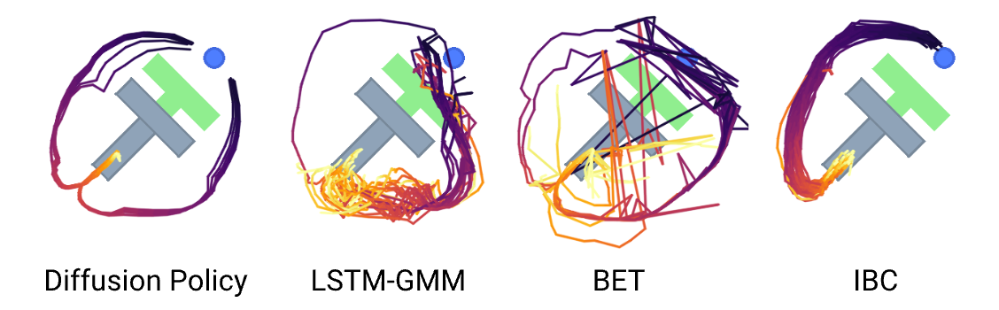
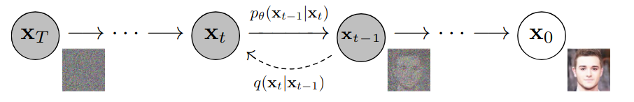
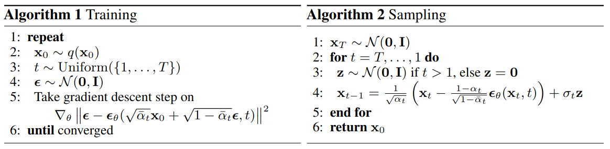
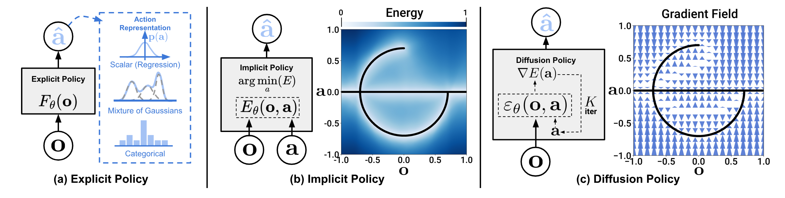

In short, using diffusion process instead of directly applying MSE loss on trajectories enables a wider variety of trajectory solutions learnt from imitation data, instead of the trajectory provided by dataset(s), which is beneficial for small-set imitation learning. In this blog post,  we will discuss how and why diffusion process can achieve such and trajectory-agnostic result. 

<!-- more -->

> This is one part of the series about energy-based learning and optimal control. A recommended reading order is: 
>
> 1. [Notes on "The Energy-Based Learning Model" by Yann LeCun, 2021](../EBM/lecun-ebm-2021.html)
> 2. Learning Data Distribution Via Gradient Estimation
> 3. From MPC to Energy-Based Policy
> 4. [How Would Diffusion Model Help Robot Imitation](../robotics/diffusion-robot-imitation.html)
> 5. Causality hidden in EBM 

## Diffusion Process Revisiting

We can start from the target functions of [DDPM](https://arxiv.org/abs/2006.11239). The forward process, where noise are added to samples, is formulated as 
$$
q(x_t|x_0)=\mathcal N(x_t; \sqrt{\bar a_t}x_0, (1-\bar a_t)\mathbf I)
$$
where $a_t=1-\beta_t$, $\bar a_t = \prod_{s=1}^t a_s$ schedules the noise level. This can be inferred from $q(x_t|x_{t-1})$ based on its markov chain property. The optimization target of network $\theta$ is formulated as predicting the noise added in the forward process at different noise levels. For example, $\mathrm {KL}(\epsilon^k, \epsilon_\theta(x^0+\epsilon^k, k))$ , where $\epsilon^k$ denotes noise generated with noise level $k$.

And if we want to add condition for the model, we can simply use these conditions with cross attention on noise predictors. 

## Paradigm: Learning Distribution by Estimating Gradients

It’s easy for researchers to come out the idea that the conditional observation-action distribution $P(A_t | O_t)$ can also be learned by estimation gradients of data distribution, which is a common paradigm of RL and IL. 

### Implicit Policy Learning

[*Score-Based Generative Modeling through Stochastic Differential Equations*](https://arxiv.org/abs/2011.13456) states that, for score matching, it's reversing a "variance exploding" SDE where more and more noise is added to data, while diffusion models are reversing a "variance preserving" SDE that interpolates between the data and a fixed variance gaussian.

### Stochastic Sampling and  Initialization

> Intuitively, multi-modality in action generation for diffusion policy arises from two sources – an underlying stochastic sampling procedure and a stochastic initialization.

## Trajectory Generation with Diffusion Models

People have been dreaming of using video or scene generation model as “world model” to guide robot planning. However, most of the information in a video frame, even for those captured in real scenarios are highly redundant for the oriented task. 

In need of a unified representation of states and actions among different training sets, especially visual training sets like Internet videos, trajectory, as a time-dependent elegant modal, is adopted by multiple works, its generation with diffusion is also a low-hanging fruit.

Flow as the Cross-domain Manipulation Interface https://arxiv.org/abs/2407.15208 

