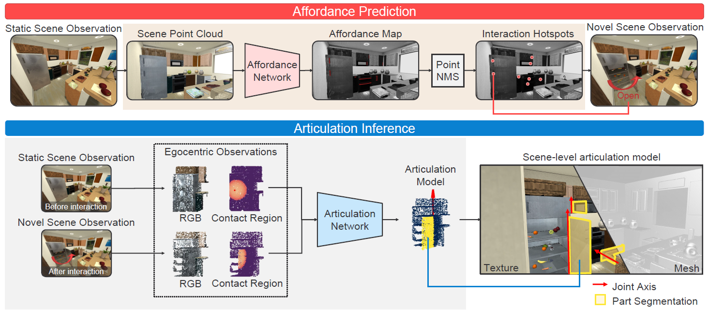
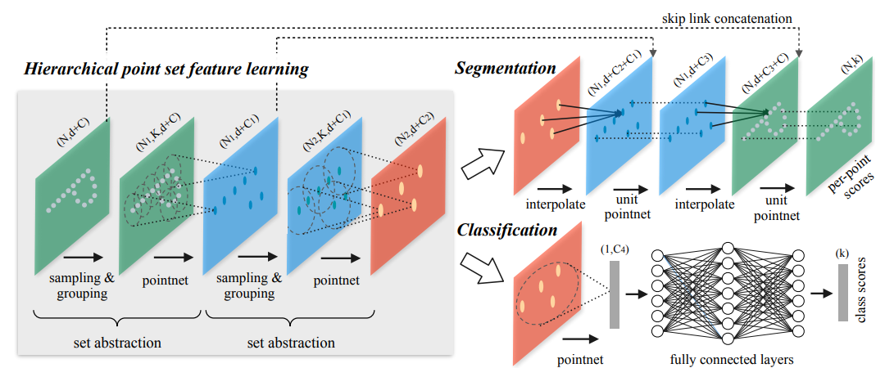

The paper proposed a way of modeling interactive objects in a large-scale 3D space by making affordance predictions and inferring the articulation properties from the visual observations before and after the self-driven interaction. 

<!-- more -->

## Workflow-In brief

- Given Initial scene observation $P_s \in \mathbb {R}^{N_s \times 6}$, each point is a 6D vector $(R,G,B,x,y,z)$ . 

- Get an affordance map $A_s\in \mathbb {R}^{N_s}$ and samples peak locations as  interaction hotspots $H_s \in \mathbb {R}^{N_h\times 3}$ *(The locations where the robot can successfully manipulate the articulated objects, and infer the articulation model)* from observation $P_s$.

- For each interaction, robot applies force to the hotspot to produce potential articulated motions.

  - Sample point cloud $P \in \mathbb {R}^{N_o\times 3}$ , $P' \in \mathbb {R}^{N_o\times 3}$ center on the interaction hotspot before and after the interaction.

  - Record contact location $c,c' \in \mathbb {R}^3$.

  - An articulation inference network segments the point cloud into static and mobile parts based on $P,P',c,c'$ .

  - Estimate articulation parameters. <a id="bib1" href="#bib1ref">[1]</a>

    - **Prismatic joint:** $\{u^p,s^p\}$, where $u^p \in \mathbb {R}^3$ is the translation axis, $s^p\in \mathbb {R}$ is the joint state, which is the relative translation distance. 

    - **Revolute joint:** $\{u^r,q,s^r\}$, where $u^r\in \mathbb {R}^3$ is the revolute axis, $q\in \mathbb {R}^3$ is the pivot point on the revolute axis, $s^r \in \mathbb {R}$ is the joint state, which is the relative rotation angle. 

- Map the estimated articulation model of each object from the global frame. The set of these articulation models constitutes the scene-level articulation model $M$.

## Modules-In detail

### Affordance Prediction

- **Estimation based on PointNet++**<a id="bib2" href="#bib2ref">[2]</a>

  

  The prediction problem is modeled as a **binary classification problem**. The observation point cloud is fed into PointNet++ to get a point-wise affordance map.

  - **Exploration driven training:** We first uniformly sample locations over the surface of both articulated and non-articulated parts, then have the robot interact with them. If the robot successfully moves any articulated part of the
    objects, we label the corresponding location as positive affordances or negative otherwise.
  - To simulate gripper-based interactions, we perform a collision check at each location to ensure enough space for placing a gripper.
  - The virtual robot interacts with the object as in reality (Pull, push or rotate).
  - For each successful interaction, we collect the robot’s egocentric observations before and after interaction and the object’s articulation model as training supervision.
  - The data distribution is imbalanced due to the large proportion of negative data. To mitigate the imbalance problem, we optimize the network with the combination of the cross-entropy loss and the dice loss。

- **Non-maximum suppression (NMS) for peak selection**

  - select the point with the maximum score and add it to the preserving set.
  - Suppress its neighbors by a certain distance threshold. 
  - Repeat this process until all points are added to the preserving set or suppressed. 

### Articulation Inference

- **Ditto: Building Digital Twins of Articulated Objects** <a id="bib3" href="#bib3ref">[3]</a>

  The occupancy decoder is discarded.

### Refinement

The estimated articulation model could have a higher accuracy if the observations covered significant articulation motions and a complete view of the object’s interior. However, these
observations may be partially occluded due to ineffective actions.

*eg.* we find that articulation estimation of a fully opened revolute joint, like $>30^\circ$, is more accurate in terms of angle error than one with an ajar joint.

Accordingly, we develop an iterative procedure of interacting with partially opened joints and refining the articulated predictions. 

- we exploit the potential motion information from the previous articulation model and extract the object-level affordance. 
- We refine the affordance prediction by selecting a pair of locations and actions to produce the most significant articulation motion. We set the force direction as the moment of the axis.

- Given the joint axis and part segment, we select the point in the predicted mobile part farthest from the joint axis as our next interaction hotspot.

## References

<a href="#bib1" id="bib1ref">[1]</a> Li, X., Wang, H., Yi, L., Guibas, L. J., Abbott, A. L., & Song, S. (2020). Category-level articulated object pose estimation. In *Proceedings of the IEEE/CVF Conference on Computer Vision and Pattern Recognition* (pp. 3706-3715). https://arxiv.org/abs/1912.11913

<a href="#bib2" id="bib2ref">[2]</a> Qi, C. R., Yi, L., Su, H., & Guibas, L. J. (2017). Pointnet++: Deep hierarchical feature learning on point sets in a metric space. *Advances in neural information processing systems*, *30*. https://arxiv.org/abs/1706.02413

pointnet [arxiv.org/pdf/1612.00593.pdf](https://arxiv.org/pdf/1612.00593.pdf)

<a href="#bib3" id="bib3ref">[3]</a> 