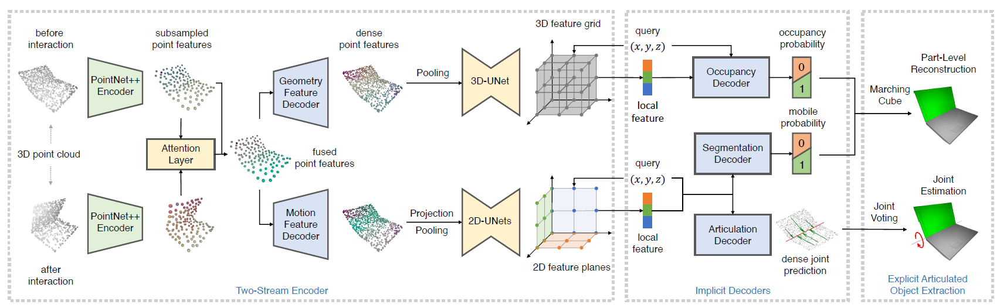
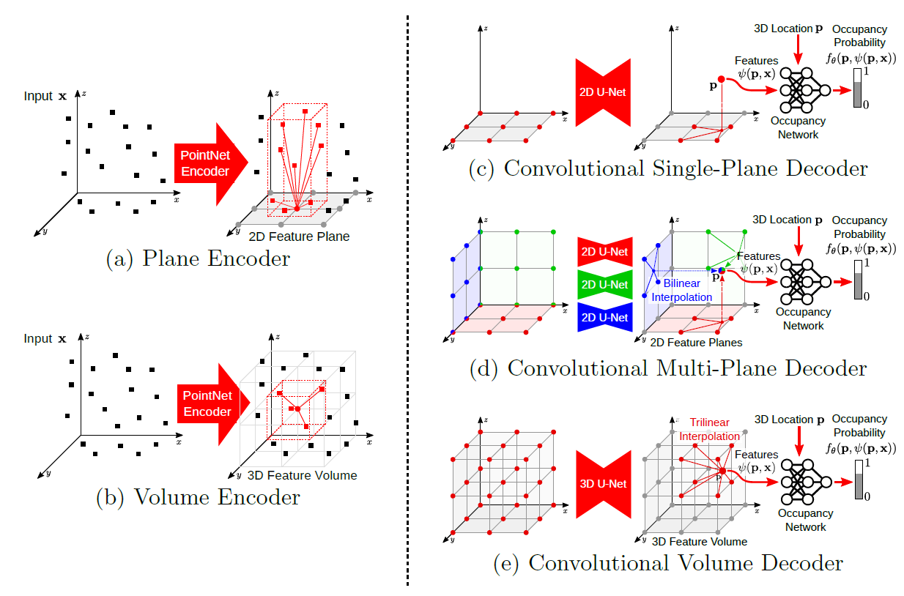
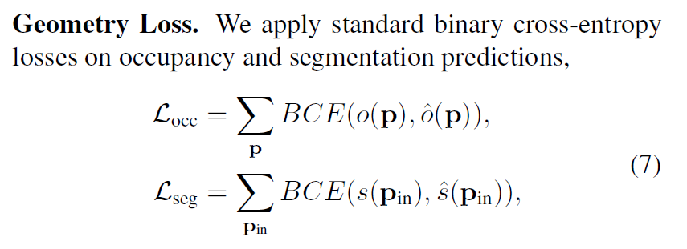
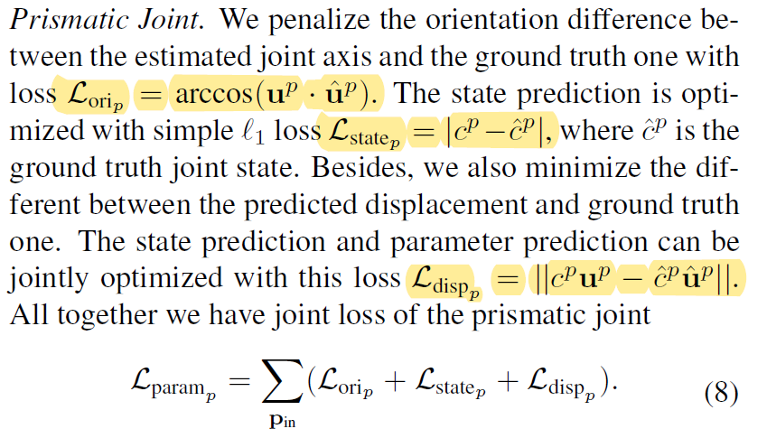
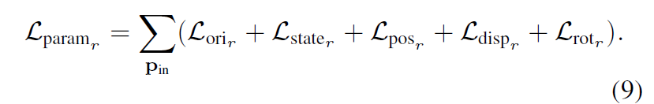
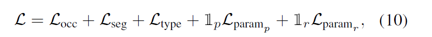

This paper propose a way to form articulation model of articulated objects by encoding the features and find the correspondence of static and mobile part via visual observation before and after the interaction.

<!-- more -->

## Workflow-In Brief

### Two Stream Encoder

- Given point cloud observations before and after interaction: $P_1,P_2 \in \mathbb R^{N\times 3}$
- Encode them with PointNet++ Encoder $\mu_{enc}$: $f_1=\mu_{enc}(P_1)$, $f_2=\mu_{enc}(P_2)$. $f_1,f_2\in \mathbb R^{N'\times d_{sub}}$. $N'<N$ is the number of the sub-sampled points, and $d_{sub}$ is the dimension of the sub-sampled point features.

- Fuse the features with attention layer: $Attn_{12}=softmax(\frac{f_1f_2^T}{\sqrt{d_{sub}}})f_2$, $f_{12}=[f_1,Attn_{12}]$, $f_{12}\in \mathbb R^{N'\times 2 d_{sub}}$.

- The fused feature is decoded by two PointNet++ decoder $\nu_{geo}$, $\nu_{art}$, and get $f_{geo}=\nu_{geo}(f_{12})$, $f_{art}=\nu_{art}(f_{12})$. $f_1,f_2\in \mathbb R^{N\times{d_{dense}}}$ are point features aligned with $P_1$

- Feature encoding based on ConvONet.

  

$f_{art}$ is projected into 2D feature planes and $f_{geo}$ is projected into voxel grids as in the ConvONets. The points that fall into the same pixel cell or voxel cell are aggregated together via max pooling.

## Training 

Revolute joint:

