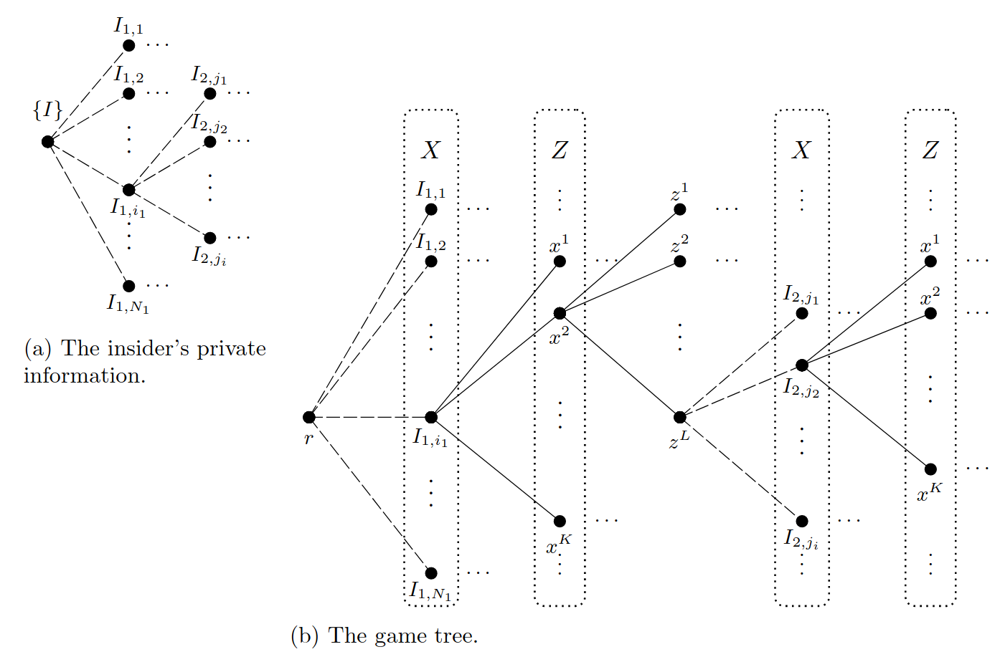

The trading behavior in a market is often backed by asymmetric information, making the market a asymmetric game. Albert S. Kyle proposed a micro-structure formulation in 1985, stating that such market consists of three players: an insider, a random noise trader, and a market maker. His successors also proved that there exist an equilibrium with additional conditions. In this post, we will discuss the formulation of Kyle's model formulated as an extensive form game and an Optimal-Transport based setting of equilibrium.

<!-- more -->

## Basic Formulation

The Initial model proposed by Kyle stated three kinds of traders in the market:

- Insider ($X$): Who knows the true value of the asset and perform strategies accordingly. 
- Noise Trader ($Z$): Who trades randomly as a Poisson process or Brownian motion.
- Market Maker (Y): Who observes the market and forms its own belief of the asset based on the summed order flow of insider and noise trader. 

Since the trading behavior is relatively noisy, one of the key contribution of Kyle's model is constructing an information-centric approach to analyze the market movement.

The market can be formulated as a game tree with nodes formulated as 
$$
\begin{align*}
        &\mathbb T_V := \{ \tau \in \mathbb T :\; \tau = r \text{ or } \tau = (I_{1, i_1}, x_1, z_1, \ldots, z_t) \} \\
        &\mathbb T_X := \{ \tau \in \mathbb T :\; \tau = I_{1, i_1} \text{ or } \tau = (I_{1, i_1}, x_1, z_1, \ldots, I_{t, i_t})\} \\
        &\mathbb T_Z := \{ \tau \in \mathbb T :\; \tau = (I_{1, i_1}, x_1) \text{ or } \tau = (I_{1, i_1}, x_1, z_1, \ldots, I_{t, i_t}, x_t) \}
\end{align*}
$$
Each round of trading can be broken down into two steps. Firstly, new  information about the true value of the asset is revealed to the insider. Secondly, both insider and noise trader simultaneously trade a discrete quantity of shares on each price level.
$$
E_X := \left\{x^1, \ldots, x^K\right\}\subseteq\mathbb R \\
E_Z := \left\{z^1, \ldots, z^L\right\}\subseteq\mathbb R
\\K,L\in\mathbb N.
$$

### Information Flow

The insider holds private information about the true value as a distribution. There are $N$ fundamental information states and the true value is a mapping
$$
v:I\rightarrow\mathbb{R},\quad i\mapsto v^i, I:=\{1,2,...N\}
$$
The flow of information at time $t$ is defined as a set-valued function of $I$. 
$$
\mathcal I_t=\{I_{t,1},...I_{t,N_t}\}\subseteq 2^I
$$

Belief formulation & Pricing System

The transition of nodes are formulated by the pricing system of market maker and strategy of insider. The direct successors of  game tree $\tau$ is given by
$$
\begin{aligned}
p_V (\tau, I_{t+1, i_{t+1}}) := \frac{\sum_{i \in I_{t+1, i_{t+1}}} \nu (\{i\})}{\sum_{j \in I_{t, i_t}} \nu (\{j\})}
\end{aligned} \qquad
                \begin{aligned}                 
                        & \text{for } t \in \{1, \ldots, T\},\ I_{t+1, i_{t+1}} \subseteq I_{t, i_{t}},\\
                        & 
\end{aligned}
$$

Equilibrium Setting

>A Kyle equilibrium is a pair $(\xi^*, S^*)\in \Xi\times \mathcal S$ satisfying:
>
>1. Given $S^*$ , the strategy $\xi^*$ is optimal.
>2. Given $\xi^*$ , the pricing system $S^*$ is rational. 

## Optimal Transport Solution

There are a few works examining nonlinear strategies *𝑋*  and the uniqueness of linear strategies in [Kyle (1985)](https://www.jstor.org/stable/1913210).

### Single-Period Kyle Model

[Cho and El Karoui (2000)](https://www.jstor.org/stable/20076254) find a nonlinear strategy for the single-period Kyle model if they use a Bernoulli distribution for the noise term. For continuous noise (*i.e.* non-atomic distributions), they also characterize the existence of a unique (linear) equilibrium.

[Boulatov, Kyle, and Livdan (2012)](https://www.nbs.rs/internet/latinica/90/90_9/AlexeiBulatov_wp.pdf) show the linear strategy is unique for the original single-period Kyle model setup. [Boulatov and Bernhardt (2015)](https://www.researchgate.net/publication/282546498_Robustness_of_equilibrium_in_the_Kyle_model_of_informed_speculation) also examine a single-period case and show that the linear strategy is  unique and robust while nonlinear strategies are not robust. Thus the  linear strategy is the equilibrium.

### Multi-Period Kyle Model

[Foster and Viswanathan (1993)](https://www.jstor.org/stable/2961988) show that for multi-period Kyle models, the linear strategy is a unique equilibrium for beliefs in the class of elliptical distributions (*e.g.* the Gaussian distribution used by Kyle).

### Continuous-time Kyle Model

[Back (1992)](https://www.jstor.org/stable/2962132) shows that in the continuous-time Kyle model, there may be nonlinear strategies. The strategies *𝑋*

 are, however, smooth and monotone in the total order size.

As an interesting aside, [Back and Baruch (2004)](https://www.jstor.org/stable/3598909) study conditions where the continuous-time Kyle model converges to the same equilibrium as the [Glosten and Milgrom (1985)](https://www.sciencedirect.com/science/article/abs/pii/0304405X85900443) model.

[Stochastic Models of Market Microstructure](https://vkulkarn.web.unc.edu/wp-content/uploads/sites/17199/2018/05/MarketDynamics.pdf)