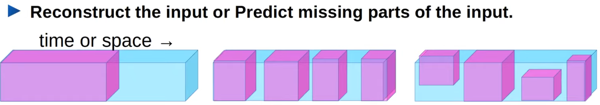
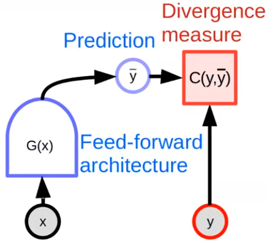
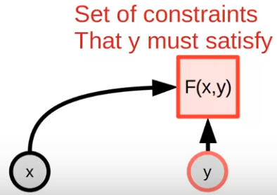
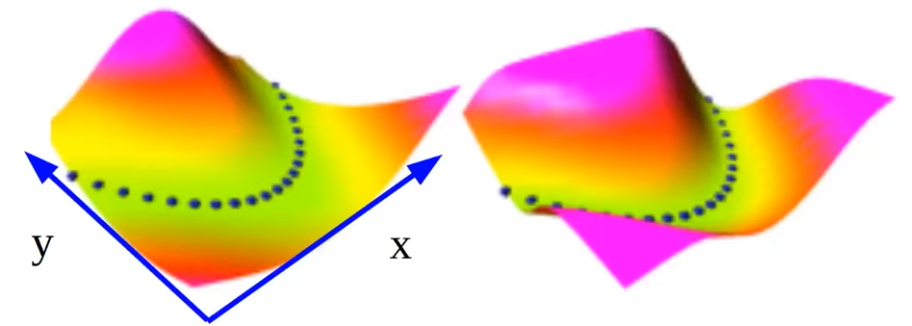
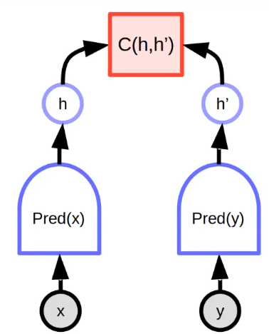
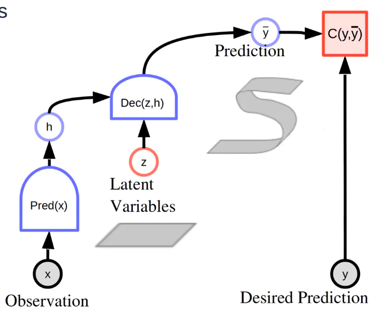
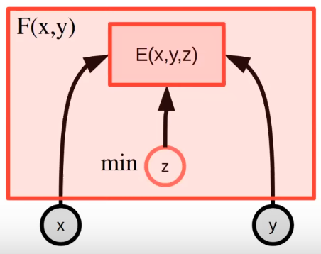
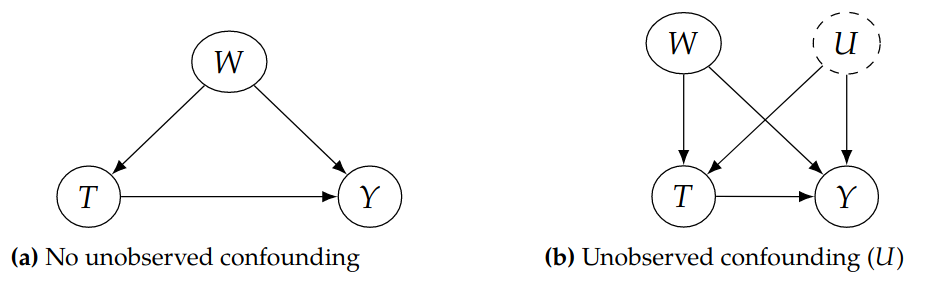
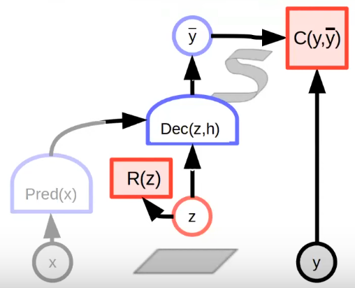
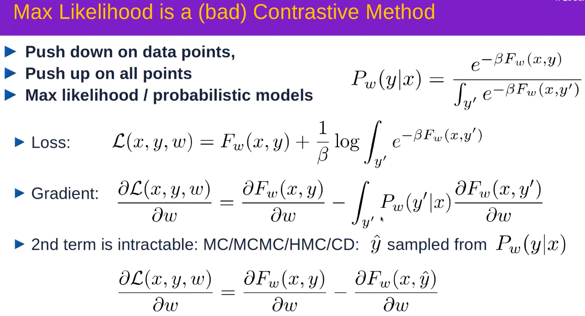

In this note we connect the energy concepts including Lagrangian Dynamics and Gibbs Formula to measuring the quality of prediction. Then we go over the inferencing and training in multi-modal scenarios. 

<!-- more -->

> This is one part of the series about energy-based learning and optimal control. A recommended reading order is: 
>
> 1. [Notes on "The Energy-Based Learning Model" by Yann LeCun, 2021](../../EBM/lecun-ebm-2021.html)
> 2. Learning Data Distribution Via Gradient Estimation
> 3. From MPC to Energy-Based Policy
> 3. [How Would Diffusion Model Help Robot Imitation](../../robotics/diffusion-robot-imitation.html)
> 3. Causality hidden in EBM
>

Recording Link: [Yann LeCun | May 18, 2021 | The Energy-Based Learning Model](https://www.youtube.com/watch?v=4lthJd3DNTM&t=2379s)

Further Readings: [A Tutorial on Energy-Based Learning](https://yann.lecun.com/exdb/publis/pdf/lecun-06.pdf)

## Reformulation of Back-propagation as Lagrangian Optimization

Instead of forces, Lagrangian mechanics uses **energy** as a unified parameter. A **Lagrangian** is a function which summarizes the dynamics of the entire system. The *non-relativistic* Lagrangian for a system of particles in the absence of an electromagnetic field is given by
$$
L=T-V
$$
where $T$ denotes total kinetic energy of the system and $V$ denotes the total potential energy, reflecting the energy of interaction between the particles. The optimization target is to minimize $L$ 

Lagrange's Equations for a time varying system with number of constraints being $C$ . Particles are labeled as $k=1,2,...,N$ and have positions $r_k\equiv (x_k,y_k,z_k)$ and velocity $v_k \equiv \dot r_k$ .
$$
\frac{\partial L}{\partial r_k}-
\frac{\mathrm d}{\mathrm d t}\frac{\partial L}{\partial \dot r_k}+
\sum^{C}_{i=1}\lambda_i\frac{\partial f_i}{\partial r_k} 
=0
$$
For each constraint equation $f_i$, there's a Lagrange multiplier $\lambda_i$ 

### Gibbs Formula [TODO]

Gibbs energy was developed in the 1870’s by Josiah Willard Gibbs.  He originally termed this energy as the “available energy” in a system.  His paper *“Graphical Methods in the Thermodynamics of Fluids”* published in 1873 outlined how his equation could predict the behavior of  systems when they are combined. This quantity is the energy  associated with a chemical reaction that can be used to do work, and is  the sum of its enthalpy $H$ and the product of the temperature $T$ and the  entropy $S$ of the system.
$$
G:=H-TS
$$

Further reading: [The Markov blankets of life: autonomy, active inference and the free energy principle](https://royalsocietypublishing.org/doi/full/10.1098/rsif.2017.0792)

## Statement in DL

- Loss

  - $L(x,y,w)=C(z_K,y)$ s.t. $z_{k+1}=g_k(z_k,w_k)$, $z_0=x$ 

- Lagrangian for optimization under constraints

  - $L(x,y,z,\lambda,w)=C(z_K,y)+\sum^{K-1}_{k=0}\lambda^T_k (z_{k+1}-g_k(z_k,w_k))$

- Optimality conditions
  $$
  \frac{\partial L(x,y,z,\lambda,w)}{\partial z_k}=0, \frac{\partial L(x,y,z,\lambda,w)}{\partial \lambda_k}=0,
  \frac{\partial L(x,y,z,\lambda,w)}{\partial w_k}=0 
  $$
  $$
  \frac{\partial L(x,y,z,\lambda,w)}{\partial z_k}=
  \lambda^T_{k-1}-\lambda^T_k \frac{\partial g_{k-1}(z_{k-1},w_{k-1})}{\partial z_k} =0
  $$

- In back propagation, the Lagrange multiplier $\lambda$ is the gradient

  

## Self Supervised Learning

- Learning hierarchical representations
- Learning predictive models
- **Uncertainty/multi-modality?**

## Energy Based Model

Using divergence measure as metrics cannot deal with futures with multiple possibilities (e.g. Multiple solutions in path planning). The average of all possibilities will possibly be the optimal result in such metrics, overfitting may also occur for datasets of insufficient samples.

We can replace the divergence measure with an energy function, which measures the "incompatibility" between $x$ and $y$. the compatible solution can be inferred using gradient descent, heruistic search etc. 

Now the target becomes "Finding an output satisfying the constraints". 

An unconditional EBM $F(y)$ measures the compatibility between components of $y$. 

For a conditional EBM  $F(x,y)$, we have low energy near provided data points, while higher energy for everywhere else. 

(PS. This optimization is in inference process)
$$
\hat y = \arg\min_y F(x,y)
$$
As a visualization:

Probabilistic models are a special case of EBM. Energies are like un-normalized negative log probabilities [^1]  .  If we want to turn energy functions as distributions, we can use **Gibbs-Boltzmann distribution**, which adopts maximum entropy approach and Gibbs formula. 
$$
P(y|x)=\frac{e^{-\beta F(x,y)}}{\int_{y'}e^{-\beta F(x,y')}}
$$
 $\beta$ is a positive constant. However the normalization constant at denominator is often intractable. One possible solution is to learn the log-likelihood of $P(y|x)$ , and the distribution is changed into
$$
\nabla_y \log P(y|x)=-\beta F(x,y)-\overbrace{\nabla_y \log {\int_{y'}e^{-\beta F(x,y')}}}^{\approx 0}
$$

## EBM for Multi-Modal Scenarios

### Joint Embedding

For the above example, the energy function is trained with the similarity of $x$ and $y$ . There may exist multiple unseen $y$ that has the same $x$ , and we may quantify those unseen $y$ by projecting them into the invariant subspace of latent $y$. 

### Latent Generative EBM

- Ideally the latent variable represents the independent explanatory factors of variation of prediction. But since it's unobservable,  information capacity of latent variable must be minimized.
- We may also see it as a "bias", or a placeholder for uncertainties. 

The inference can be formulated as: 
$$
\hat y, \hat z = \arg \min_{y,z} E(x,y,z)
$$
However the latent variable is not presented and cannot be measured in supervised manner. So we will have to minimize its effect.
$$
F_\infty (x,y) = \min_z E(x,y,z)
$$

$F$ is a free energy model and constrained on "temperature" term $\beta$ as previously shown in Gibbs-Boltzmann distribution. In practice, $\beta$ can be a variance schedule (eg. DDPM). 
$$
F_\beta =-\frac{1}{\beta} \log \int_z e^{-\beta E(x,y,z)}
$$

$$
\hat y =\arg \min_y F(x,y)
$$

If we try to understand this in a causal approach, we can treat $z$ as a unobserved confounder, which causes a biased estimation of the effect of $x$ on $E$. 
$$
P(E|\mathrm{do}(x)) \neq P(E|x)
$$
This $\mathrm{do}(\cdot)$ operator means an intervention (or call it adjustment) of $x$. The intervention cannot "back-propagate" to confounder thus the result is changed. 

The "adjust formula" provides an unbiased solution by taking all $z$ into consideration. However the domain of $z$ is often intractable and we need to regularize it so it's small enough to neglect. 
$$
P(E|\mathrm{do}(x)) = \int_z P(E|x,z)P(z)
$$
On the contrary, we can also examine the robustness of $E$ with sensitivity analysis. This connects to the concept of "quantify the uncertainty of unseen $y$ by projecting them into the invariant subspace of latent $y$" mentioned above. 

> For those may be interested: Sensitivity analysis of such EBM:
>
> \*For simplicity, we directly write $x$ for $\mathrm{Pred}(x)$ . \*
>
> If we treat the above generative EBM as a causal graph, assuming linear relationship among variables (non-linear scenes will be derived in the following posts), we will have: 
> $$
> \left\{
> \begin{aligned}
> 	\mathrm{Dec}&=\alpha_x x+\alpha_z z \\
> 	C&=\beta_x x + \beta_z z +\beta_y y+\delta \mathrm{Dec}
> \end{aligned}
> \right.
> $$
> We can obtain the confounding bias by adjusting $x$, leading to different $\hat y$, and gets confounding bias: 
> $$
> \mathrm{Bias}=\frac{\alpha_z}{\beta_z}
> $$
> The Average total Effect (ATE) of $z$ on $C$ is as 
> $$
> \frac{\mathrm d C}{\mathrm dz} = \frac{\partial C}{\partial {y}} \frac{\partial {y}}{\partial {z}}+
> \frac{\partial C}{\partial {\hat y}} \frac{\partial {\hat y}}{\partial {z}} = \delta+\mathrm{Bias}
> $$
> By assuming the distribution of $z$, we can derive the uncertainty of $\hat y$ by "propagating". 
> $$
> \mathrm{Var}(\hat y) = (\frac{\partial {\hat y}}{\partial {z}})^2\mathrm{Var}(z) + 
> (\frac{\partial {\hat y}}{\partial {x}})^2\mathrm{Var}(x) + 
> 2\frac{\partial {\hat y}}{\partial {x}} \frac{\partial {\hat y}}{\partial {z}} \mathrm{Cov}(z,x)
> $$
> We can use the **Fisher Information**, which is defined to be the variance of the score function, to further state the uncertainty. This will come in the next post that provides a more detailed formulation of score function and EBM.

## Training of EBM

Shape $F(x,y)$ so that:

- $F(x[i], y[i])$ is strictly smaller than $F(x[i], y)$ for all $y$ different from $y[i]$.
- Keep $F$ smooth. (Max-likelihood probabilistic methods breaks this) [More](#why-max-likelihood-sucks-in-contrastive-method)

Existing approaches:

- Contrastive-based
  $$
  L(x,y,\hat y) = [F_\theta(x,y) - F_\theta(x,\hat y)+m(y,\hat y)]^+
  $$
  where $\hat y$ is negative sample.

- Regularized / Architectural methods: Minimize the volume of low-energy regions.

  ​	e.g. Limit the capacity of latent: 
  $$
  L(x,y)=F_\theta(x,y)=\min_z [C(\mathrm{Dec}(\mathrm{Pred}(x),z),y)+R(z)]
  $$
  

[^1]: Further readings of learning data distributions: [*Generative Modeling by Estimating Gradients of the Data Distribution*](https://yang-song.net/blog/2021/score/)
[^2]: KL divergences are comparisons between Gaussians, so they can be calculated in a Rao-Blackwellized fashion with closed form expressions instead of high variance Monte Carlo estimate

## Appendix

### Why Max-Likelihood Sucks in Contrastive Method

Makes the energy landscape into a valley. 