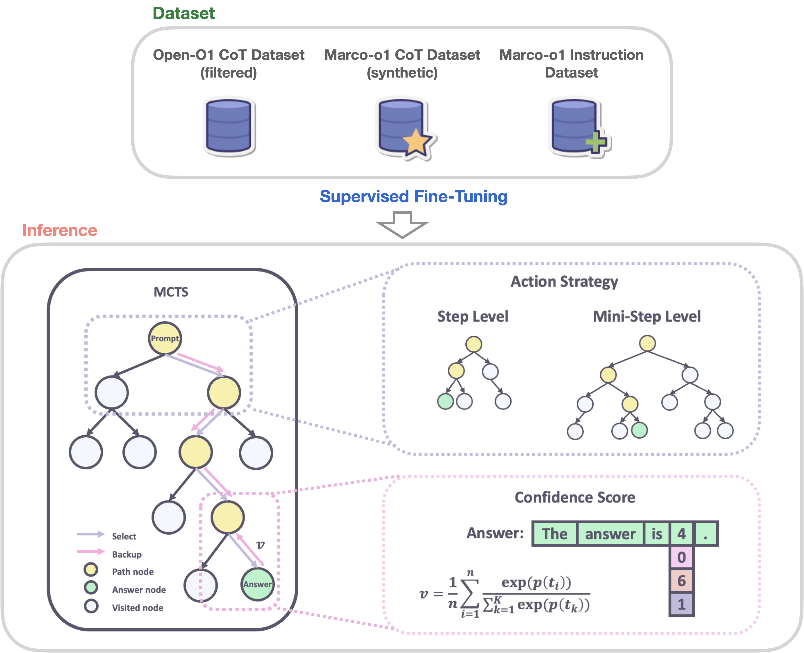

Macro-o1 7B is the first o1-like open source LLM. In this post, we will dive into its training paradigm and its inference implementation. 

<!-- more -->

- Code link: https://github.com/AIDC-AI/Marco-o1
- Paper link: https://arxiv.org/abs/2411.14405



# Training Paradigm

Macro-o1 adopts full-param SFT using existing CoT datasets by OpenAI and synthetic dataset generated by open source LLM. Compared with previous SFT, a CoT dataset provides a linear path for LLM to follow, while LLM can also explore other action nodes for exploration. This may lead to a balance between exploration and exploitation, significantly reduces the distribution shift caused by bias within dataset.

## MCTS Revisit


- *Selection*: Start from root *R* and select successive child nodes until a leaf node *L* is reached. The root is the current game state and a leaf is any node that has a potential child from which no simulation (playout) has yet been initiated. The section below says more about a way of biasing  choice of child nodes that lets the game tree expand towards the most  promising moves, which is the essence of Monte Carlo tree search.
- *Expansion*: Unless *L* ends the game decisively (e.g. win/loss/draw) for either player, create one (or more) child nodes and choose node *C* from one of them. Child nodes are any valid moves from the game position defined by *L*.
- *Simulation*: Complete one random playout from node *C*. This step is sometimes also called playout or rollout. A playout may be as simple as choosing uniform random moves until the game is decided (for example in chess, the game is won, lost, or drawn).
- *Backpropagation*: Use the result of the playout to update information in the nodes on the path from *C* to *R*.

## Training Procedures

In the training procedure, "action" is formulated as LLM outputs, or to say, the fixed-length tokens $\{t_i\}^N_{i=1}$. Then the value of each state is obtained by applying the softmax function to  its log probability and the log probabilities of the top 5 alternative tokens. 
$$
c_i=\frac{\exp(p(t_i))}{\sum^5_{k=1}\exp(p(t_k))}
$$
Here $p(t_i)$ is the log probability of token generated by LLM, and $p(t_k)$ denotes the top $k$ predicted tokens at step $i$.  Thus the reward of a state is obtained as:
$$
v=\frac{1}{N}\sum^N_{i=1}c_i
$$


## Dataset Preparation

Besides Open-O1 dataset, they also built a synthetic dataset using MCTS. An example of CoT data is provided in [CoT_demo.json](https://github.com/AIDC-AI/Marco-o1/blob/main/data/CoT_demo.json) . It's generated by Qwen2.5-7B-Instruct using the above value formulation for tree search.


# Inference

Macro-o1 has a `vllm` implementation based on `Qwen2Model`. 

Compared with original Qwen structure, it adds a `generate_response` function above model's forward instead of directly use `model.generate()`. The following is `huggingface` implementation, which is more detailed than `vllm` ones.

```python
def generate_response(model, tokenizer,
                      input_ids, attention_mask,
                      max_new_tokens=4096):
    generated_ids = input_ids
    with torch.inference_mode():
        for _ in range(max_new_tokens):
            outputs = model(input_ids=generated_ids, attention_mask=attention_mask)
            next_token_id = torch.argmax(outputs.logits[:, -1, :], dim=-1).unsqueeze(-1)
            generated_ids = torch.cat([generated_ids, next_token_id], dim=-1)
            attention_mask = torch.cat([attention_mask, torch.ones_like(next_token_id)], dim=-1)
            new_token = tokenizer.decode(next_token_id.squeeze(), skip_special_tokens=True)
            print(new_token, end='', flush=True)
            if next_token_id.item() == tokenizer.eos_token_id:
                break
    return tokenizer.decode(generated_ids[0][input_ids.shape[-1]:], skip_special_tokens=True)
```

Such generation process exposes the logits of tokens to achieve the above MCTS procedures. 


In Macro's implementation, `<Thought>` and `<\Thought>` are not special tokens!