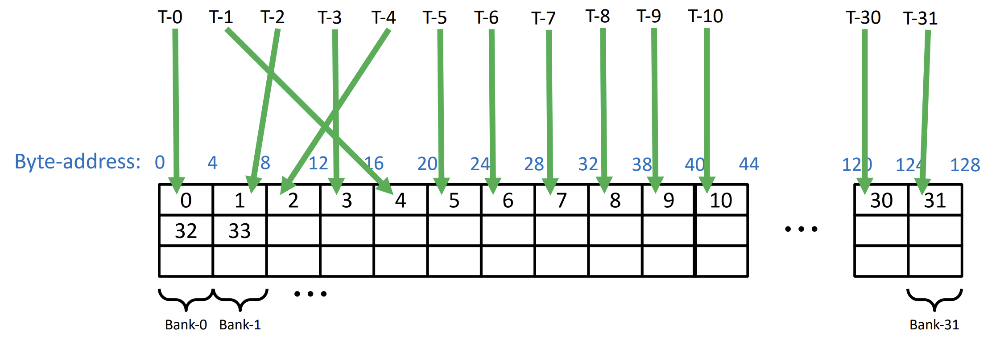
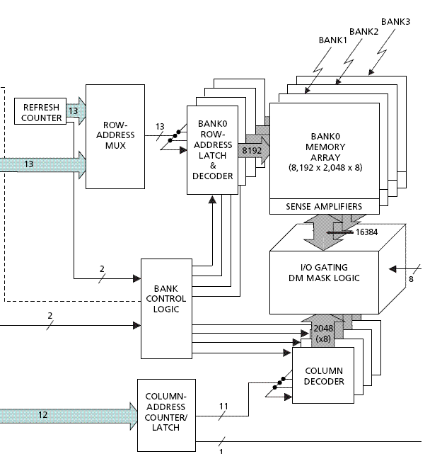
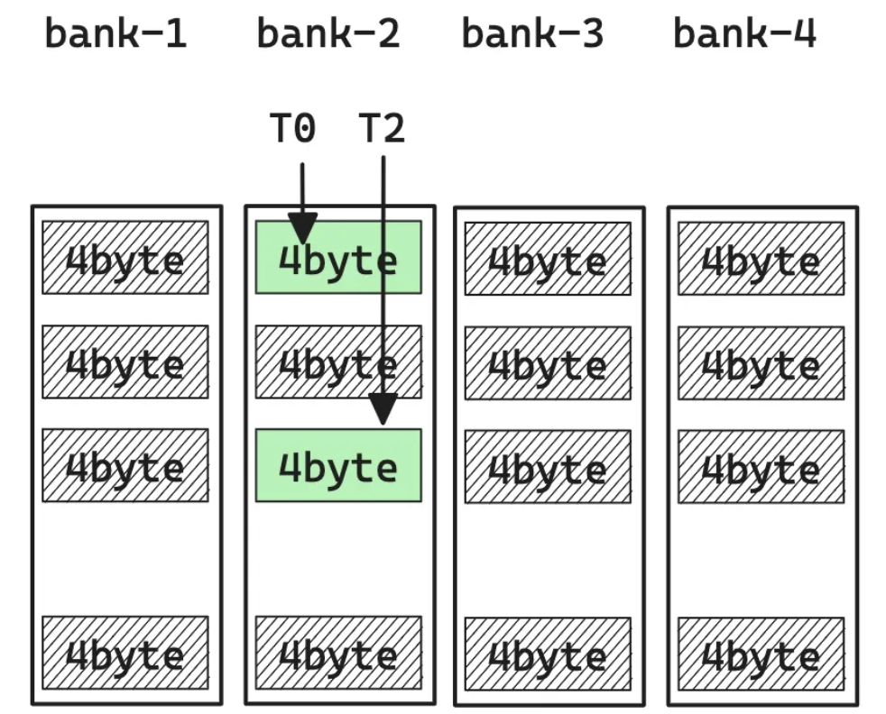
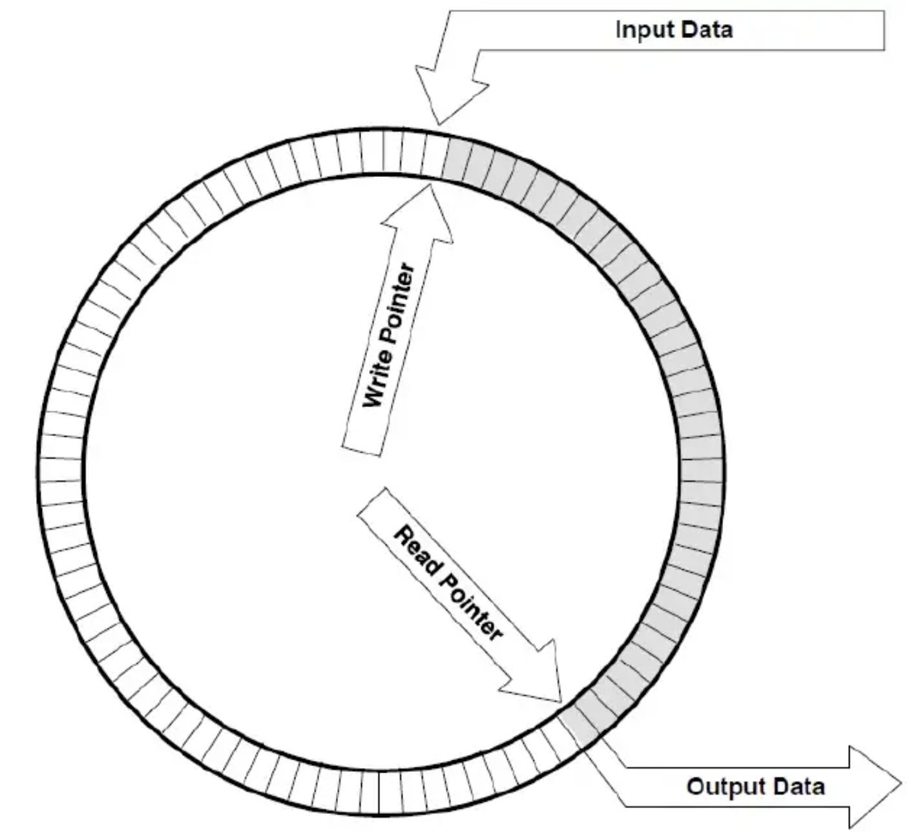

**Abstract** To avoid shared memory conflict in shared memory for each thread in different banks, swizzling is invented to create offsets for memory allocation. Which means, finding places for the memory that requested by a Layout.

<!-- more -->

> In [computer graphics](https://en.wikipedia.org/wiki/Computer_graphics), **swizzles** are a class of operations that transform [vectors](https://en.wikipedia.org/wiki/Vector_space) by rearranging components. Swizzles can also project from a vector of one dimensionality to a vector of another dimensionality, such as taking a three-dimensional vector and creating a two-dimensional or five-dimensional vector using components from the original vector.
>
> Wikipedia, "Swizzling"

Previously: [Hierarchical Tensor and the Story of Indexing]()

Reference Link: [cutlass](https://github.com/NVIDIA/cutlass)

## Motivation


Each thread are having their own memory. However, in tasks that needs the joint forces of threads, a shared memory is needed to perform better cooperation. For example, for the tasks of GEMM like $D=AB+C$, matrices are staying the shared memory waiting to be visited and calculated. Each part of the shared memory is carefully allocated in each bank.

 

Everything looks well, isn't it?

***What if they don't?***



Let's first have a glance at how threads extract bits from RAM. To access data, threads provide memory addresses they want, memory controllers will map them into chip selection signal, bank selection signal and physical address on chip(Row and column). Building the mapping of  addr->(bank, physical address). Moreover, the each bank and address index can only be used once. Thus, when it comes to situation where threads are trying to access different address of the same bank, it will cause a "BANK CONFLICT" which makes the data retrieval cannot be done in a single clock cycle. 



To accelerate the process, people have develop a way of mapping that can maximize the data extracted in each clock cycle. This is the "swizzling" we are talking about today.

To simplify the entire process, we will state the physical address as row and banks as column. So the entire memory model looks like a big rectangle.

## Method

Let me try to revoke your memory about Data structure lectures. You may have heard about "Circular Queue", and the core of it is taking the remainder as index of head and tail. This is also the core spirit of swizzling.





```python
class CircularQueue():
	def __init__(self, size): # initializing the class
		self.size = size
		# initializing queue with none
		self.queue = [None for i in range(size)] 
		self.front = self.rear = -1
        self.step = 1
	def enqueue(self, data):
		# condition if queue is full
		if ((self.rear + 1) % self.size == self.front): 
			print(" Queue is Full\n")
		# condition for empty queue
		elif (self.front == -1): 
			self.front = 0
			self.rear = 0
			self.queue[self.rear] = data
		else:
			# next position of rear
			self.rear = (self.rear + self.step) % self.size 
			self.queue[self.rear] = data
			
	def dequeue(self):
		if (self.front == -1): # condition for empty queue
			print ("Queue is Empty\n")
			
		# condition for only one element
		elif (self.front == self.rear): 
			temp=self.queue[self.front]
			self.front = -1
			self.rear = -1
			return temp
		else:
			temp = self.queue[self.front]
			self.front = (self.front + 1) % self.size
			return temp

```




The swizzling problem can be modeled as follows. Given the memory offset from `Layout`, which can be seen as the logical address, the `Swizzle` method is required to find out the physical address on the chip.
$$
Offset=\text{Swizzle}(\text{Layout}(index))
$$
Based on the circular queue example, we can easily formulate that we can build a "circular queue" for each thread in which heads and tails belongs to each thread  do not show up in the same bank.

So we can build a class like this, which can be called by `Swizzle(Layout(index))`: 

```python
class Swizzle:
  	def __init__(self, Bbits:int, Mbase:int, Sshift:int):
        '''
        :param Bbits: 2^B Row(Threads) in the arrangement.
        :param Mbase: 2^M Number of layout indices to be the basic element contiguously stored in banks.
        :param Sshift: 2^S Columns(Banks) in the arrangement.
        '''
        assert abs(Sshift) >= Bbits
	def __call__(self, offset:int):
        '''
        :param offset: logical offset provided by Layout(index)
        '''
    def size(self):
        return 1 << (self.Bbits + self.Mbase + abs(self.Sshift))
```


In one word, there will be $2^B$ threads looking for $\lceil Layout.size()/2^M\rceil$ blocks stored in $2^S$ banks. Inside each bank, spaces for $\lceil 2^S/2^B \rceil$ blocks are allocated. Inside the space, there will be $\lceil (Layout.size()/2^M)/2^B\rceil$ blocks.

The maximum "width" of threads shall be $2^B/2^M$, and the maximum banks involved shall be $size/2^M=2^{B+S}$. 


Let's first consider the situation where we can query all data we need in one cycle, which means every bank only contains just 1 or 0 "base" block. 

Since no banks will show up for the second time, we can simplify it as the circular queue above. Inside the big "queue", all banks are allocated equal size of  "sub-queues", whose head address (Remember the unit is index of `Layout`) can be: 

```python
rear = (rear + 2^B) % size
```

The size is $2^{B+M+|S|}$ in the unit of `Layout` index.

Wait...How can we get the `rear` here?

Clearly the `rear` is similar to offset, and it's related to the pointers that steps towards after each insertion. We only need to convert it to the index in the unit of `Layout` index. 

```python
blk = offset//(2**M) # number of blocks ahead of index we look for
in_blk_offset = offset%(2**M)# Local index inside block

thd = blk//(2**S) #The index of thread that will visit it

in_thd_offset = blk%(2**S)#Local index inside thread

bnk = thd%(2**B) #The bank visited by thread
# We can also call it "in_bnk_offset" since bank starts from 0

Swizzle(offset) = bnk*(2**B)+in_thd_offset*(2**S)+in_blk_offset
```

Looks easy, isn't it? However, these operations are a bit slow in calculation, so we can setup them as shifting and bitwise operations.

Calculation to bitwise operations
$$
\begin{aligned}
num \mid 2^n&=num>>n\\\\
num(\mod 2^n)&= num \& (2^n-1) \\\\
num\cdot 2^n&=num<<n 
\end{aligned}
$$
Here the $2^n-1$ is used as a "mask" to obtain the remainder. 


Actually, we can simply send the offsets to where they need to go and do calculations with the corresponding slices, and ignore other digits! 

How can we send them there? Where is the corresponding slices? 

First, let's rethink the sub-queue example. An offset can be hashed into a (`bnk`, `thd`, `blk`). Among these variables, who can appear for the second time for another offset without causing bank conflict? 

The answer is `bank`! 

(Hint, think of the stages where banks are not enough and we need to visit RAM for the second time)

Let's take a 32bit logical address as example:

```python
assign offset[31:0]
assign swizzle[31:0]
# Extract the part for bnk:
bnk = offset>>(M+S) & (1<<B-1) = offset&(1<<(S+M+B)-1)[31:S+M]#bit_msk
thd = bnk>>S = offset>>(M+S)=offset[31:M+S]
blk = offset>>M = offset[31:S]

in_blk_offset = offset & (1<<M-1) = offset[M-1:0]
in_thd_offset = (offset>>M) & (1<<S-1)=offset&(1<<(S+M)-1)[31:M]

#To take the slice we need, we can
(offset & (bnk<<S))
# Then align to the place we need
(offset & (bnk<<S))>>S
# Finally, let's create a hashing from the block to swizzle
swizzle = offset ^ ((offset & (bnk<<S))>>S)
```

p.s. You can read more about XOR and its applications by learning about [Cyclic Redundancy Check](https://en.wikipedia.org/wiki/Cyclic_redundancy_check).

## Conclusion

what a marvelous journey back to discrete mathematics, computer architecture and Verilog! This implementation has provided me with a tremendous insight into the application of number theory in designing memory mapping. Previously what I am trying to do is proving everything is alright via strict clock constraints and complex inter-clock domain techniques so it can pass the STA and other test cases. However, via number theory, we can reduce the stress by proving things will work mathematically. 

Quite a pleasure to be able to sit still and read through the project!